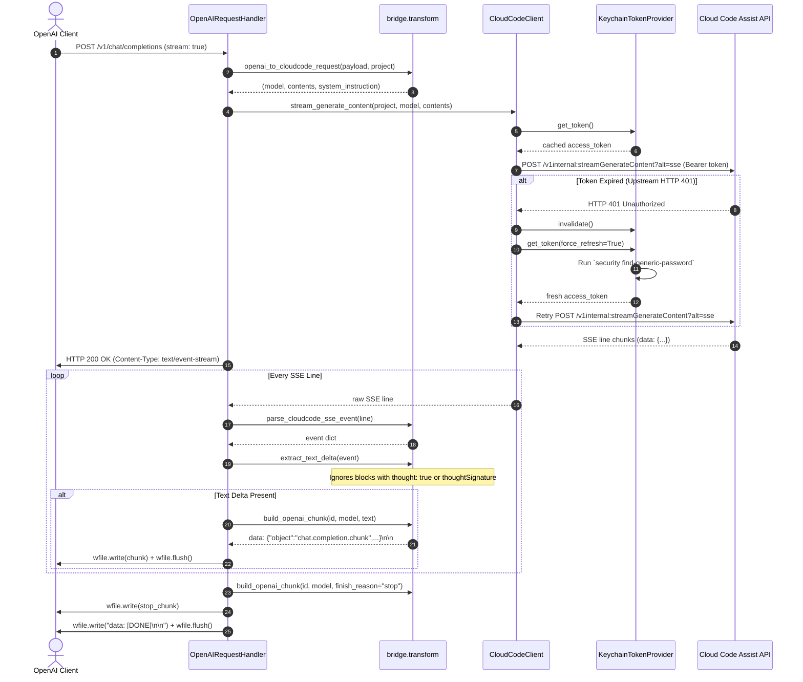

# Design: MVP Antigravity Model Bridge

## Technical Approach

The Antigravity Model Bridge is a zero-dependency, local HTTP reverse-proxy and adapter bridging OpenAI-compatible clients to Google Cloud Code Assist (`daily-cloudcode-pa.googleapis.com`). Adhering to Clean/Hexagonal Architecture:
1. **Ports & Adapters**: Upstream transport (`client.py`) and token extraction (`auth.py`) act as outbound adapters; `server.py` acts as inbound primary HTTP adapter.
2. **Pure Domain Transforms**: `transform.py` contains 100% pure conversion functions with zero I/O, decoupling protocol logic from networking.
3. **Zero Dependencies**: Pure Python 3.10+ standard library (`http.server`, `urllib.request`, `subprocess`, `json`, `base64`, `threading`).

---

## Architecture Decisions

### Decision 1: Modular Package Layout (`bridge/`) vs Monolithic Script

| Option | Tradeoffs | Decision |
|---|---|---|
| Monolithic `bridge.py` | Single file to distribute; couples transport, parsing, and server; prevents isolated unit testing | Rejected |
| **Modular `bridge/` Package** | 5 focused modules (`auth`, `client`, `transform`, `server`, `__main__`); pure functions isolated in `transform`; clean mock boundaries for TDD | **Selected** |

- **Choice**: Modular package in `bridge/` separating auth, client, pure transforms, server, and CLI entrypoint.
- **Alternatives considered**: Single-file script (`bridge.py`).
- **Rationale**: Isolates domain translation from I/O; enables pure unit testing of OpenAI <-> Cloud Code transforms without network mocks; conforms to Uncle Bob's Clean Architecture dependency rule (dependencies point inward).

### Decision 2: In-Memory Thread-Safe TTL Token Cache with 60s Margin & 401 Re-Read

| Option | Tradeoffs | Decision |
|---|---|---|
| Per-request Keychain read | Stateless, but spawns `security` subprocess every request adding 15–40ms latency | Rejected |
| Static token load at startup | Fails when background Antigravity daemon refreshes OAuth tokens | Rejected |
| **Thread-Safe TTL Cache + 401 Re-Read** | Microsecond cache lookups; proactive refresh before token expiry; self-heals transparently on HTTP 401 | **Selected** |

- **Choice**: `KeychainTokenProvider` stores `access_token` and UNIX `expiry` timestamp behind a `threading.Lock`. Valid while `now < expiry - 60s`. On upstream HTTP 401, invalidates cache and triggers exactly one immediate Keychain re-read before propagating errors.
- **Alternatives considered**: Synchronous CLI invocation per request; long-lived static bearer token.
- **Rationale**: Balances sub-millisecond local latency with resilience against OAuth token rotation by the Antigravity CLI daemon.

### Decision 3: Direct Line-Buffered SSE Streaming with `wfile.flush()` & Thought Filtering

| Option | Tradeoffs | Decision |
|---|---|---|
| Full stream accumulation | Simple usage calculation, but destroys real-time streaming; high TTFT (time-to-first-token) | Rejected |
| **Direct Line-Buffered SSE Pipeline** | Minimal memory overhead; instantaneous token delivery; shared upstream code path for stream and non-stream | **Selected** |

- **Choice**: Stream lines directly from `urllib.request.urlopen` response. Parse `data: {...}` lines in real time, extract `candidates[0].content.parts[].text`, filter out thought metadata (`thought: true`, `thoughtSignature`), write OpenAI chunks `data: {"id":..., "object":"chat.completion.chunk", ...}\n\n` to `wfile`, and immediately call `wfile.flush()`. Close with `data: [DONE]\n\n`. Non-streaming requests reuse the generator by accumulating text chunks.
- **Alternatives considered**: Buffering complete responses in memory before emitting chunks.
- **Rationale**: OpenAI clients require low first-token latency; filtering reasoning artifacts (`thought: true`) prevents internal CoT tags from polluting user completions.

### Decision 4: Concurrency Model via `http.server.ThreadingHTTPServer`

| Option | Tradeoffs | Decision |
|---|---|---|
| Single-threaded `HTTPServer` | Head-of-line blocking; concurrent SSE streams block all subsequent requests | Rejected |
| `asyncio` / `aiohttp` | Async event loop; requires complex async SSE handling or external packages | Rejected |
| **`ThreadingHTTPServer`** | Standard library; spawns lightweight thread per connection; naturally isolates blocking SSE streams | **Selected** |

- **Choice**: Standard library `http.server.ThreadingHTTPServer` paired with `OpenAIRequestHandler`.
- **Alternatives considered**: Default single-threaded `HTTPServer`, `asyncio` standard server.
- **Rationale**: SSE streams hold connections open for seconds. A threading server handles concurrent clients without blocking, requires zero dependencies, and maintains straightforward procedural code.

### Decision 5: Standardized OpenAI Error Adapter

| Option | Tradeoffs | Decision |
|---|---|---|
| Pass-through raw upstream JSON | Exposes internal Google API errors; breaks client SDK exception parsers | Rejected |
| **Mapped OpenAI RFC Error Schema** | Translates upstream status codes into standard OpenAI error envelopes with actionable messages | **Selected** |

- **Choice**: Map exceptions to `{"error": {"message": ..., "type": ..., "code": ...}}`:
  - 400: `invalid_request_error`
  - 401: `authentication_error` (prompts user to verify Keychain / `agy login`)
  - 404: `invalid_request_error` ("Model not found")
  - 429: `rate_limit_error` ("Google Cloud Code Assist rate limit exceeded")
  - 503: `api_error` ("Model capacity exhausted upstream")
  - Timeout: `api_error` (HTTP 504)
- **Alternatives considered**: Raw 500 error pass-through.
- **Rationale**: OpenAI SDKs and tools (Claude Code, FreeLLMAPI, Cursor) require strict adherence to OpenAI error schemas to trigger appropriate client-side retries and error reporting.

---

## Data Flow

### Component Interaction Architecture

```
[OpenAI Client (curl / SDK / FreeLLMAPI)]
                  │
                  ▼  (HTTP POST /v1/chat/completions)
┌─────────────────────────────────────────────────────────┐
│ bridge.server: ThreadingHTTPServer                      │
│ └── OpenAIRequestHandler                                │
│       ├── Validates JSON & parameters                   │
│       │                                                 │
│       ├── bridge.transform                              │
│       │   └── openai_to_cloudcode_request()             │
│       │       (systemInstruction, role: user/model)     │
│       │                                                 │
│       ├── bridge.client: CloudCodeClient                │
│       │   ├── bridge.auth: KeychainTokenProvider        │
│       │   │   └── security find-generic-password        │
│       │   │       (In-memory TTL cache + 401 recovery)  │
│       │   │                                             │
│       │   └── urllib.request.urlopen (SSE stream)       │
│       │       POST /v1internal:streamGenerateContent    │
│       │                                                 │
│       ├── bridge.transform                              │
│       │   ├── parse_cloudcode_sse_event()               │
│       │   ├── extract_text_delta() (filters thought)    │
│       │   └── build_openai_chunk()                      │
│       │                                                 │
│       └── self.wfile.write(...) + self.wfile.flush()    │
└─────────────────────────────────────────────────────────┘
                  │
                  ▼  (HTTPS SSE line chunks)
[Google Cloud Code Assist (daily-cloudcode-pa.googleapis.com)]
```

### Complex Flow: Real-Time SSE Streaming & 401 Recovery



---

## File Changes

| File | Action | Description |
|---|---|---|
| `bridge/__init__.py` | Create | Package initialization and version definition (`__version__ = "0.1.0"`). |
| `bridge/__main__.py` | Create | CLI entry point parsing `--host` / `--port` and starting `ThreadingHTTPServer`. |
| `bridge/auth.py` | Create | `KeychainTokenProvider` managing `security` CLI extraction and TTL token caching. |
| `bridge/client.py` | Create | `CloudCodeClient` for upstream `loadCodeAssist`, `fetchAvailableModels`, and `streamGenerateContent`. |
| `bridge/transform.py` | Create | Pure transformation functions between OpenAI and Cloud Code schemas with thought filtering. |
| `bridge/server.py` | Create | `ThreadingHTTPServer` and `OpenAIRequestHandler` handling `/healthz`, `/v1/models`, `/v1/chat/completions`. |
| `scripts/smoke_test.py` | Create | Standalone live verification script executing all endpoint contracts. |
| `tests/__init__.py` | Create | Test package marker. |
| `tests/test_auth.py` | Create | Unit tests for keychain extraction, JSON decoding, TTL caching, and 401 invalidation. |
| `tests/test_client.py` | Create | Unit tests for HTTP request creation, header injection, 401 retry, and status code mapping. |
| `tests/test_transform.py` | Create | Pure unit tests for role conversion, SSE parsing, delta extraction, and thought filtering. |
| `tests/test_server.py` | Create | Integration tests for request routing, streaming chunks, JSON responses, and error translation. |

---

## Interfaces / Contracts

### Module: `bridge.auth`

```python
class AuthenticationError(Exception):
    """Raised when Keychain reading or token decoding fails."""
    pass

class KeychainTokenProvider:
    def __init__(self, service: str = "gemini", account: str = "antigravity", ttl_margin_seconds: int = 60) -> None: ...
    def get_token(self, force_refresh: bool = False) -> str: ...
    def invalidate(self) -> None: ...
    def _read_keychain(self) -> str: ...
    def _decode_credentials(self, raw_secret: str) -> tuple[str, float]: ...
```

### Module: `bridge.client`

```python
class BridgeError(Exception): pass
class AuthenticationError(BridgeError): pass
class InvalidRequestError(BridgeError): pass
class ModelNotFoundError(BridgeError): pass
class RateLimitError(BridgeError): pass
class CapacityExhaustedError(BridgeError): pass
class UpstreamTimeoutError(BridgeError): pass

class CloudCodeClient:
    def __init__(self, token_provider: KeychainTokenProvider, base_url: str = "https://daily-cloudcode-pa.googleapis.com", timeout: float = 60.0) -> None: ...
    def load_code_assist(self) -> dict: ...
    def fetch_available_models(self, project: str) -> list[dict]: ...
    def stream_generate_content(self, project: str, model: str, contents: list[dict], system_instruction: dict | None = None) -> Iterator[str]: ...
    def _request(self, path: str, payload: dict, stream: bool = False, retry_on_401: bool = True) -> urllib.response.addinfourl | bytes: ...
```

### Module: `bridge.transform` (Pure Functions)

```python
def openai_to_cloudcode_request(openai_payload: dict, project: str) -> tuple[str, list[dict], dict | None]:
    """Validates OpenAI payload, extracts model, builds Cloud Code contents and systemInstruction."""
    ...

def parse_cloudcode_sse_event(raw_line: str) -> dict | None:
    """Parses 'data: {...}' line into dict; returns None for heartbeats/empty lines."""
    ...

def extract_text_delta(event_dict: dict) -> str | None:
    """Extracts text chunk from candidates[0].parts; drops blocks with thought: true or thoughtSignature."""
    ...

def extract_finish_reason(event_dict: dict) -> str | None:
    """Extracts finishReason ('stop') if candidate finished."""
    ...

def extract_usage(event_dict: dict) -> dict | None:
    """Translates usageMetadata into OpenAI usage format."""
    ...

def build_openai_chunk(completion_id: str, model: str, delta_text: str | None = None, finish_reason: str | None = None, usage: dict | None = None) -> str:
    """Serializes a single OpenAI SSE chunk 'data: {...}\\n\\n'."""
    ...

def build_openai_completion(completion_id: str, model: str, full_text: str, usage: dict | None = None) -> dict:
    """Constructs non-streaming OpenAI chat.completion JSON object."""
    ...

def build_openai_model_list(upstream_models: list[dict]) -> dict:
    """Constructs OpenAI model list response object."""
    ...

def build_openai_error_response(status_code: int, message: str, error_type: str) -> tuple[int, dict]:
    """Generates standard OpenAI error payload and HTTP code."""
    ...
```

### Module: `bridge.server`

```python
class OpenAIRequestHandler(http.server.BaseHTTPRequestHandler):
    client: CloudCodeClient
    project: str

    def do_GET(self) -> None: ...  # Routes /healthz, /v1/models
    def do_POST(self) -> None: ... # Routes /v1/chat/completions
    def _handle_chat_completion(self, body: dict) -> None: ...
    def _send_json(self, status_code: int, data: dict) -> None: ...
    def _send_error(self, exc: Exception) -> None: ...

def create_server(host: str = "127.0.0.1", port: int = 8080, client: CloudCodeClient | None = None, project: str | None = None) -> http.server.ThreadingHTTPServer: ...
def run_server(host: str = "127.0.0.1", port: int = 8080) -> None: ...
```

---

## Testing Strategy

### Layered Testing Matrix

| Layer | What to Test | Approach |
|---|---|---|
| **Unit (Domain Transforms)** | Role translation (`system`, `user`, `assistant`), SSE parsing, `thought: true` filtering, chunk formatting, error JSON format | Pure `unittest.TestCase` with zero mocks, fixtures with realistic Google Cloud Code Assist responses |
| **Unit (Auth & Cache)** | Keychain decoding, 60s TTL expiration margin, thread safety under concurrent calls, 401 cache invalidation | Mock `subprocess.run` to return simulated `go-keyring-base64:` payloads; verify lock contention |
| **Unit (Upstream Client)** | Request headers, JSON payload formatting, status code mapping (400, 401, 404, 429, 503, timeout), 401 single-retry | Mock `urllib.request.urlopen` with simulated HTTP responses and `HTTPError` exceptions |
| **Integration (HTTP Server)** | `/healthz`, `/v1/models`, `/v1/chat/completions` (JSON & SSE), concurrent requests, error status codes | Ephemeral `ThreadingHTTPServer` bound to port 0 (`127.0.0.1:0`), tested with `urllib.request` clients |
| **E2E / Smoke** | Real upstream communication via macOS Keychain credentials | Standalone `scripts/smoke_test.py` running against live bridge instance |

### Strict TDD Execution Plan (`python3 -m unittest`)

Execution follows Red-Green-Refactor cycles across 4 phases:
1. **Cycle 1 (`test_transform.py`)**: Write failing tests for role translation, thought block filtering, and chunk serialization. Implement pure functions in `bridge/transform.py` until green.
2. **Cycle 2 (`test_auth.py`)**: Write failing tests for Keychain base64 decoding, TTL expiration buffer, and 401 cache clearing. Implement `bridge/auth.py` until green.
3. **Cycle 3 (`test_client.py`)**: Write failing tests for header attachment, discovery endpoints, error status mapping, and 401 retry. Implement `bridge/client.py` until green.
4. **Cycle 4 (`test_server.py`)**: Write failing integration tests for routing, SSE line flushing, and OpenAI error envelopes. Implement `bridge/server.py` and `bridge/__main__.py` until green.
5. **Cycle 5 (`scripts/smoke_test.py`)**: Implement verification script and validate full suite with `python3 -m unittest discover tests`.

---

## Migration / Rollout

No database migration, environment variables, or external package installations are required.

- **Rollout**: Run `python3 -m bridge --port 8080`. Point any OpenAI client (e.g., Cursor, Claude Code, FreeLLMAPI) to `http://127.0.0.1:8080/v1` with any dummy API key (`sk-antigravity`).
- **Rollback**: Terminate the bridge process. Remove `bridge/`, `tests/`, and `scripts/smoke_test.py`.

---

## Open Questions

None. All upstream interfaces (`loadCodeAssist`, `fetchAvailableModels`, `streamGenerateContent`), payload schemas, Keychain formats, and error behaviors were verified empirically during the exploration phase.
