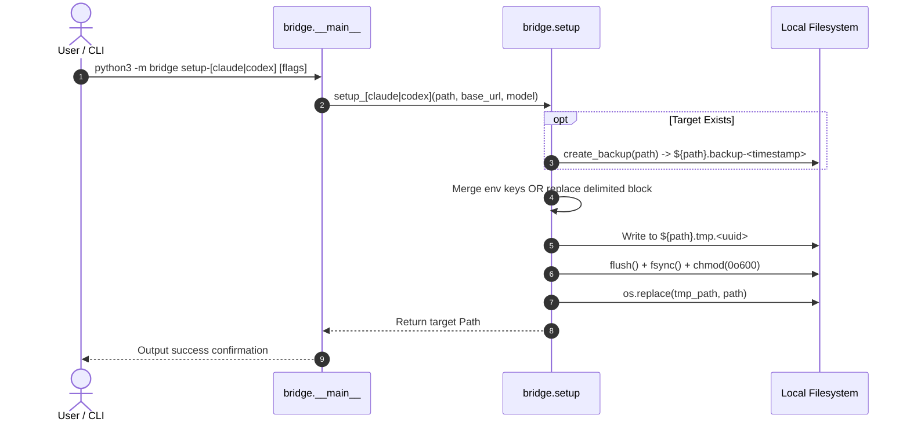

# Design: Native Client Setup CLI & Gemini 3.8 Flash High Aliasing

## Technical Approach

Provide zero-dependency CLI setup commands (`setup-claude`, `setup-codex`) and centralized model aliasing. Setup subcommands perform atomic file replacement via directory-local temp files with `fsync`, preceded by ISO-8601 timestamped backups. Claude Code configuration merges gateway variables into `~/.claude/settings.json["env"]`, while Codex CLI configuration manages an idempotent `# agy:start` ... `# agy:end` block in `~/.codex/config.toml`. Model requests omitting or aliasing models (`auto`, `gemini-3.8-flash-high`, `gemini-3.8-flash`) resolve to `gemini-3.8-flash-tiered` with `thinkingLevel: "HIGH"`, respecting explicit client thinking overrides.

## Architecture Decisions

| Decision Area | Options Considered | Tradeoffs | Selected Approach & Rationale |
|---|---|---|---|
| **Atomic File Writing** | 1. In-place overwrite<br>2. OS-level atomic replace via tempfile | In-place risks corruption during power loss/crash; tempfile requires same filesystem | **Option 2**: Create `${path}.tmp.${uuid}` in same directory, flush, `os.fsync`, `os.chmod(0o600)`, then `os.replace`. Eliminates partial writes. |
| **Codex TOML Mutation** | 1. Third-party TOML parser/serializer<br>2. Delimited regex block replacement | Full TOML parser adds dependencies; raw manipulation risks clobbering tables | **Option 2**: Multi-line regex `^[ \t]*# agy:start[\s\S]*?^[ \t]*# agy:end\s*`. Zero external dependencies, preserves comments, tables, and formatting. |
| **CLI Subcommand Dispatch** | 1. Strict subparser enforcement<br>2. Dual-mode parser supporting daemon & subcommands | Subparsers default to failing when no command given; manual parsing is fragile | **Option 2**: Inspect `sys.argv[1]`; if `setup-claude` or `setup-codex`, parse setup arguments; otherwise fall back to daemon server parser with `--port`, `--host`, etc. |
| **Model & Thinking Aliasing** | 1. Per-shim mapping in anthropic/responses<br>2. Centralized resolver in `transform.py` | Per-shim duplicates logic and drifts; centralized ensures identical behavior | **Option 2**: `resolve_model_and_thinking()` in `transform.py`. Centralizes default fallback, aliasing, and thinking level resolution. |

## Data Flow



## File Changes

| File | Action | Description |
|---|---|---|
| `bridge/setup.py` | Create | Implements `atomic_write_file`, `create_backup`, `setup_claude`, and `setup_codex`. |
| `bridge/__main__.py` | Modify | Adds subcommand routing for `setup-claude` and `setup-codex` while maintaining daemon default. |
| `bridge/transform.py` | Modify | Implements `resolve_model_and_thinking` for flash-high/auto aliasing and thinking level mapping. |
| `bridge/anthropic.py` | Modify | Uses `resolve_model_and_thinking` in `anthropic_to_cloudcode_request`; supports optional model. |
| `bridge/responses.py` | Modify | Uses `resolve_model_and_thinking` in `responses_to_cloudcode_request`; supports optional model. |
| `bridge/dashboard.py` | Modify | Updates client setup cards to render `python3 -m bridge setup-...` commands. |
| `tests/test_setup.py` | Create | Unit tests for atomic write, backup creation, Claude JSON merge, and Codex TOML block. |

## Interfaces / Contracts

```python
# bridge/setup.py
def atomic_write_file(path: Path, content: str, mode: int = 0o600) -> None: ...
def create_backup(path: Path) -> Path | None: ...
def setup_claude(
    settings_path: Path,
    base_url: str = "http://127.0.0.1:8080",
    model: str = "gemini-3.8-flash-high",
    auth_token: str = "antigravity",
) -> Path: ...
def setup_codex(
    config_path: Path,
    base_url: str = "http://127.0.0.1:8080/v1",
    model: str = "gemini-3.8-flash-high",
) -> Path: ...

# bridge/transform.py
def resolve_model_and_thinking(
    model: str | None,
    payload: dict[str, Any],
) -> tuple[str, dict[str, Any] | None]: ...
```

### Codex Delimited Block Specification

```toml
# agy:start
model = "{model}"
model_provider = "agy"
model_context_window = 1048576
model_auto_compact_token_limit = 943718

[model_providers.agy]
name = "AGY Bridge"
base_url = "{base_url}"
wire_api = "responses"
requires_openai_auth = false
# agy:end
```

## Testing Strategy

| Layer | What to Test | Approach |
|---|---|---|
| Unit (`test_setup.py`) | `atomic_write_file` atomicity, permissions (`0o600`), and parent directory creation (`0o700`). | Isolated `tempfile.TemporaryDirectory` assertions on file content and octal mode. |
| Unit (`test_setup.py`) | `create_backup` ISO timestamp formatting and non-existent file handling. | Verify `.backup-YYYY-MM-DDTHH-MM-SS` suffix and content copy; assert None on missing. |
| Unit (`test_setup.py`) | `setup_claude` fresh creation, env key merging, and key preservation. | Test empty settings, partial existing settings with custom keys, and backup creation. |
| Unit (`test_setup.py`) | `setup_codex` fresh block creation, in-place block replacement, and idempotency. | Test empty config, config with existing tables, repeated runs ensuring single block. |
| Unit (`test_transform.py`) | `resolve_model_and_thinking` aliases and payload overrides. | Test `None`, `""`, `"auto"`, `"gemini-3.8-flash-high"`, and explicit thinking overrides. |
| Unit (`test_anthropic.py` / `test_responses.py`) | End-to-end request translation with aliased/omitted models. | Verify upstream request receives `gemini-3.8-flash-tiered` and HIGH thinkingLevel. |

## Migration / Rollout

No migration required. Client configuration updates are non-destructive and generate ISO-8601 backups (`*.backup-<timestamp>`) before modifying any user file.

## Open Questions

None. All interfaces and requirements are determined and covered by pure standard library.
