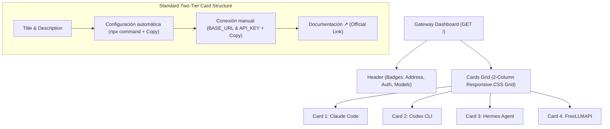

# Design: FreeLLMAPI Standard Client Cards for Dashboard

## Technical Approach

Refactor the embedded local gateway dashboard (`GET /` in `bridge/dashboard.py`) to align with FreeLLMAPI client setup card standards. Replace the previous 3-card layout with 4 dedicated client cards: **Claude Code**, **Codex CLI**, **Hermes Agent**, and **FreeLLMAPI**.

The implementation maintains zero external dependencies using Python 3 standard library (`html`, `http.server`, `urllib`). The architecture introduces a declarative card descriptor schema (`CLIENT_CARDS`), a responsive 2-column CSS grid with 16px radius Vercel dark aesthetics (`#000000`/`#111111`/`#222222`), standardized two-tier setup blocks ("Configuración automática" via `npx freellmapi` and "Conexión manual" with `BASE_URL`/`API_KEY`), official documentation links, and independent snippet copy handlers.

## Architecture Decisions

| Decision | Option Selected | Tradeoffs Considered | Rationale |
|---|---|---|---|
| Card Component Model | Declarative data list (`CLIENT_CARDS`) with template interpolation | Hardcoded HTML string vs Jinja2 vs dictionary schema | DRY rendering across 4 cards; eliminates code duplication while maintaining zero external templating dependencies. |
| Grid Layout | CSS Grid `repeat(2, minmax(0, 1fr))` collapsing to `1fr` at 768px | Flexbox wrap vs CSS float vs single-column stack | Provides balanced desktop presentation for 4 cards while guaranteeing no horizontal overflow on mobile viewports. |
| Setup Granularity | Two-tier layout ("Configuración automática" + "Conexión manual") | Single concatenated command vs modal dialogs | Separates instant one-line CLI setup from explicit IDE/env configuration without UI clutter. |
| Clipboard Architecture | Element ID parameterized `copySnippet(btn, id)` with range fallback | Global copy delegation vs external library | Pure zero-dependency JS; reliably manages 8 independent copy targets with 2s visual confirmation. |

## Component & Layout Architecture



## File Changes

| File | Action | Description |
|---|---|---|
| `bridge/dashboard.py` | Modify | Define `CLIENT_CARDS` schema, 2-column grid CSS (16px radius), two-tier card template, and doc links. |
| `tests/test_dashboard.py` | Modify | Assert 4 cards, automatic/manual sections, 16px styling, responsive breakpoint, and doc links. |
| `scripts/smoke_test.py` | Modify | Update stage [3/9] to verify all 4 client cards, two-tier sections, and doc links. |

## Interfaces / Contracts

```python
# bridge/dashboard.py - Declarative Card Schema
CLIENT_CARDS: list[dict[str, Any]] = [
    {
        "id": "claude",
        "title": "Claude Code",
        "desc": "Anthropic Messages API CLI (Base URL without /v1)",
        "auto_cmd": lambda addr: f"npx freellmapi setup-claude --url http://{addr}",
        "manual_snippet": lambda addr: f"BASE_URL=http://{addr}\nAPI_KEY=local-bridge",
        "docs_url": "https://code.claude.com/docs",
    },
    {
        "id": "codex",
        "title": "Codex CLI",
        "desc": "OpenAI Responses API CLI (wire_api = 'responses')",
        "auto_cmd": lambda addr: f"npx freellmapi setup-codex --url http://{addr}/v1",
        "manual_snippet": lambda addr: f"BASE_URL=http://{addr}/v1\nAPI_KEY=local-bridge",
        "docs_url": "https://developers.openai.com/docs/codex",
    },
    {
        "id": "hermes",
        "title": "Hermes Agent",
        "desc": "NousResearch Hermes Agent CLI (Base URL with /v1)",
        "auto_cmd": lambda addr: f"npx freellmapi setup-hermes --url http://{addr}/v1",
        "manual_snippet": lambda addr: f"BASE_URL=http://{addr}/v1\nAPI_KEY=local-bridge",
        "docs_url": "https://hermes-agent.nousresearch.com",
    },
    {
        "id": "freellmapi",
        "title": "FreeLLMAPI",
        "desc": "Custom Provider & Aider integration (Base URL with /v1)",
        "auto_cmd": lambda addr: f"npx freellmapi setup --url http://{addr}/v1",
        "manual_snippet": lambda addr: f"BASE_URL=http://{addr}/v1\nAPI_KEY=local-bridge",
        "docs_url": "https://github.com/tashfeenahmed/freellmapi",
    },
]
```

## Testing Strategy

| Layer | What to Test | Approach |
|---|---|---|
| Unit (`tests/test_dashboard.py`) | 4 cards presence, two-tier sections, 16px radius, CSS media query, 8 snippet IDs, and doc links | Python `unittest` parsing and asserting substrings in generated HTML. |
| Regression (`tests/test_dashboard.py`) | Status badges, address formatting, wildcard host substitution (`0.0.0.0` -> `127.0.0.1`), token expiry | Existing test suite assertions preserved and updated. |
| E2E (`scripts/smoke_test.py`) | Live HTTP GET / verification across real socket | Stage [3/9] checks all 4 cards, both setup tiers, and doc links. |

## Migration / Rollout

No migration required. Presentation-only update:
- Underlying gateway endpoints (`/`, `/healthz`, `/v1/models`, `/v1/chat/completions`, `/v1/messages`, `/v1/responses`) remain unchanged.
- Pure HTML/CSS/JS changes rendered dynamically per request.
- Rollback: Revert git commit.

## Open Questions

None. Card copy, commands, documentation URLs, and layout breakpoints are fully resolved.
