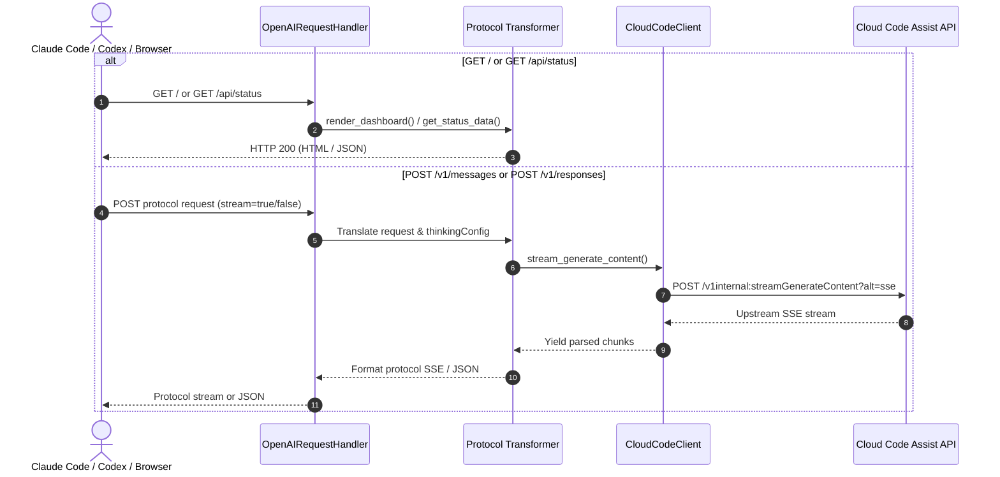

# Design: Local Gateway Dashboard & Protocol Shims

## Technical Approach

Transform `agy-model-bridge` into a multi-protocol local AI gateway serving three client ecosystems while providing an embedded dark-mode dashboard at `GET /`. Built with standard Python 3 stdlib (`http.server`, `urllib`, `json`), requiring zero external dependencies.

`OpenAIRequestHandler` in `bridge/server.py` dispatches requests across four routes:
1. `GET /` & `GET /api/status`: Embedded HTML dashboard and live state JSON (`bridge/dashboard.py`).
2. `POST /v1/chat/completions`: Preserved OpenAI Chat Completions (`bridge/transform.py`).
3. `POST /v1/messages`: Anthropic Messages API shim for Claude Code CLI (`bridge/anthropic.py`).
4. `POST /v1/responses`: OpenAI Responses API shim for Codex CLI (`bridge/responses.py`).

All routes share `CloudCodeClient` and `KeychainTokenProvider`. Reasoning is configured via `build_thinking_config` in `bridge/transform.py`, applying thinking levels (`-high`, `-medium`, `-low`) or `thinkingBudget: 0` on standard Gemini models to prevent token starvation.

## Architecture Decisions

| Decision | Option Selected | Tradeoffs Considered | Rationale |
|---|---|---|---|
| Protocol Shims | Dedicated modules (`bridge/anthropic.py`, `bridge/responses.py`) | Monolithic `transform.py` vs dedicated modules | Isolates distinct protocol schemas and events; avoids regressions in core OpenAI transformer. |
| Dashboard Delivery | Embedded HTML/CSS/JS template | External assets / Jinja2 vs inline string | Zero dependencies; zero CDN requirements; instant render without filesystem lookup overhead. |
| Streaming Translation | Generator pipeline yielding formatted SSE strings | Buffered line re-serialization vs streaming generators | Preserves real-time token delivery, minimal memory footprint, strict protocol sequence compliance. |
| Thinking Heuristics | Model suffix match (`-high`, `-low`) + `thinkingBudget: 0` fallback | User flags vs automatic inference with payload override | Automatically prevents Gemini thinking starvation while honoring explicit client configurations. |

## Data Flow



## File Changes

| File | Action | Description |
|---|---|---|
| `bridge/dashboard.py` | Create | Dark-mode HTML/CSS/JS template and status rendering functions. |
| `bridge/anthropic.py` | Create | Anthropic Messages request/response transforms, SSE builder, and error formatters. |
| `bridge/responses.py` | Create | OpenAI Responses request/response transforms, SSE builder, and error formatters. |
| `bridge/transform.py` | Modify | Add `build_thinking_config()` with suffix heuristics and payload overrides. |
| `bridge/server.py` | Modify | Multi-route dispatch (`/`, `/api/status`, `/v1/messages`, `/v1/responses`). |
| `scripts/smoke_test.py` | Modify | 9-step test asserting all endpoints, schemas, and SSE streams. |
| `tests/test_dashboard.py` | Create | Tests for dashboard HTML, status badges, and copy snippet content. |
| `tests/test_anthropic.py` | Create | Tests for Anthropic Messages request/response translation and SSE sequence. |
| `tests/test_responses.py` | Create | Tests for OpenAI Responses request/response translation and SSE sequence. |
| `tests/test_transform.py` | Modify | Tests for adaptive `thinkingConfig` generation across model variants. |
| `tests/test_server.py` | Modify | Tests for multi-protocol dispatch, status endpoint, and error mapping. |

## Interfaces / Contracts

```python
# bridge/transform.py
def build_thinking_config(model: str, payload: dict[str, Any]) -> dict[str, Any] | None: ...

# bridge/dashboard.py
def render_dashboard(host: str, port: int, auth_status: dict[str, Any], models_count: int) -> str: ...
def get_status_data(client: Any, project: str, host: str, port: int) -> dict[str, Any]: ...

# bridge/anthropic.py
def anthropic_to_cloudcode_request(payload: dict[str, Any], project: str) -> tuple[str, list[dict], dict | None, dict | None]: ...
def build_anthropic_sse_events(lines_gen: Iterator[str], model: str) -> Iterator[str]: ...

# bridge/responses.py
def responses_to_cloudcode_request(payload: dict[str, Any], project: str) -> tuple[str, list[dict], dict | None, dict | None]: ...
def build_responses_sse_events(lines_gen: Iterator[str], model: str) -> Iterator[str]: ...
```

## Testing Strategy

| Layer | What to Test | Approach |
|---|---|---|
| Unit | Protocol transforms, thinkingConfig, SSE sequences, dashboard template | `unittest` with mock payloads and SSE streams in `tests/test_*.py`. |
| Integration | Server routing dispatch, error formatting, HTTP stream delivery | `unittest` using test client and loopback `ThreadingHTTPServer`. |
| E2E | Live multi-protocol smoke test across all 9 endpoints | Run `scripts/smoke_test.py` against active bridge server. |

## Migration / Rollout

No migration required. All changes are additive:
- Existing `/v1/chat/completions`, `/v1/models`, and `/healthz` endpoints remain unchanged.
- New endpoints bind to existing daemon port.
- Rollback: Revert git commit.

## Open Questions

None. All protocol specifications and model reasoning defaults are fully resolved.
