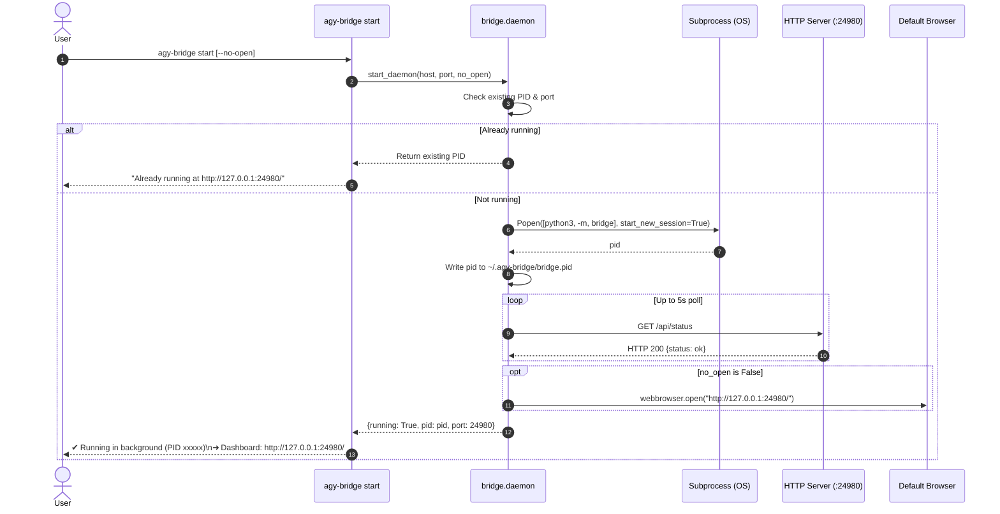
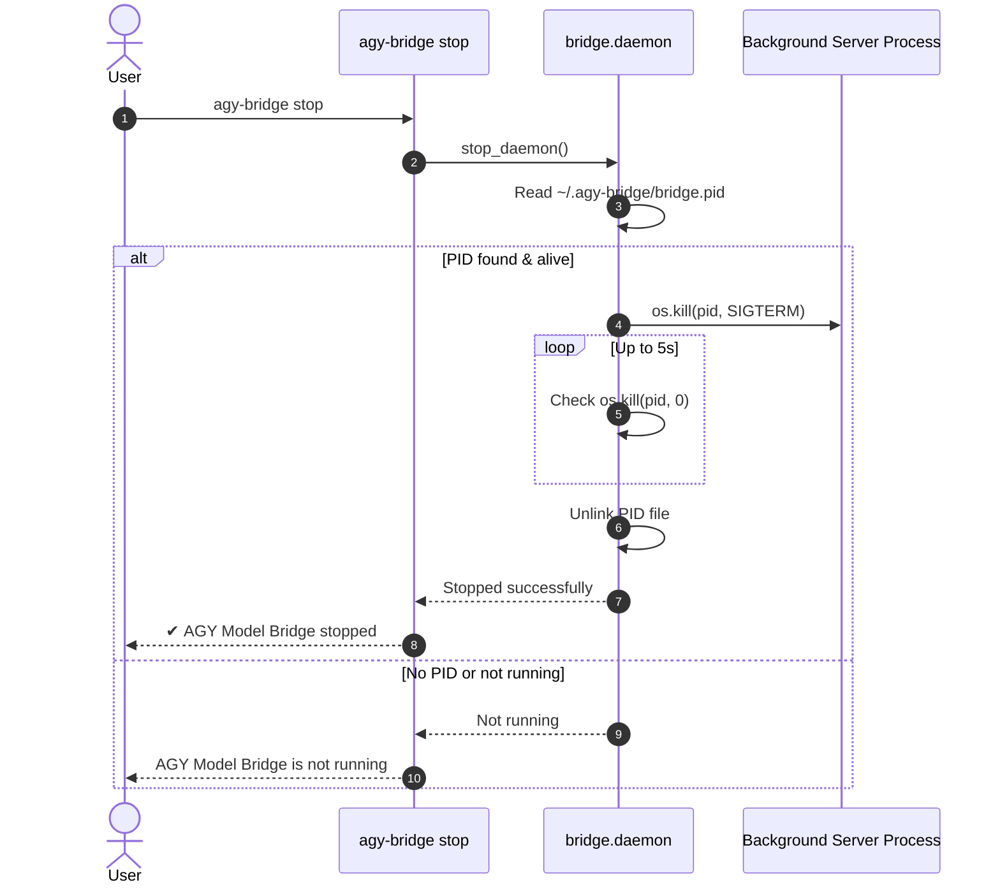

# Design: Daemon Lifecycle CLI & One-Line Distribution

## Architecture Overview

```mermaid
flowchart TD
    User["Developer / User"] -->|agy-bridge start| CLI["bridge/__main__.py"]
    CLI -->|start_daemon()| DaemonMgr["bridge/daemon.py"]
    DaemonMgr -->|subprocess.Popen start_new_session=True| DaemonProc["bridge (Background Process)"]
    DaemonProc -->|Writes PID| PIDFile["~/.agy-bridge/bridge.pid"]
    DaemonProc -->|Logs output| LogFile["~/.agy-bridge/bridge.log"]
    DaemonMgr -->|Poll health /api/status| DaemonProc
    DaemonMgr -->|webbrowser.open()| Browser["Default Web Browser (Dashboard)"]
```

## Sequence Diagrams

### 1. `agy-bridge start` Flow



### 2. `agy-bridge stop` Flow



## Key Decisions and Rationale

1. **Pure Python 3 standard library daemonization:**  
   Using `subprocess.Popen` with `start_new_session=True` (and redirection to `~/.agy-bridge/bridge.log`) detaches the background process cleanly from the controlling terminal across all POSIX systems (macOS and Linux) without requiring external packages like `daemonize` or `psutil`.

2. **PID file storage in `~/.agy-bridge/`:**  
   Standard XDG/user-space directory path. Ensures permissions `0o700` on directory and `0o600` on PID file to isolate user state.

3. **`webbrowser.open()` for zero-friction feedback:**  
   Using Python's built-in `webbrowser.open()` provides seamless cross-browser launching on macOS (Safari, Chrome, Arc, Brave) without spawning shell scripts or AppleScript dependencies.

4. **One-line installer `install.sh`:**  
   Clones into `~/.local/share/agy-model-bridge` and creates an executable launcher script in `~/.local/bin/agy-bridge`. Automatically prompts the user if `~/.local/bin` is not yet on their `PATH`.
